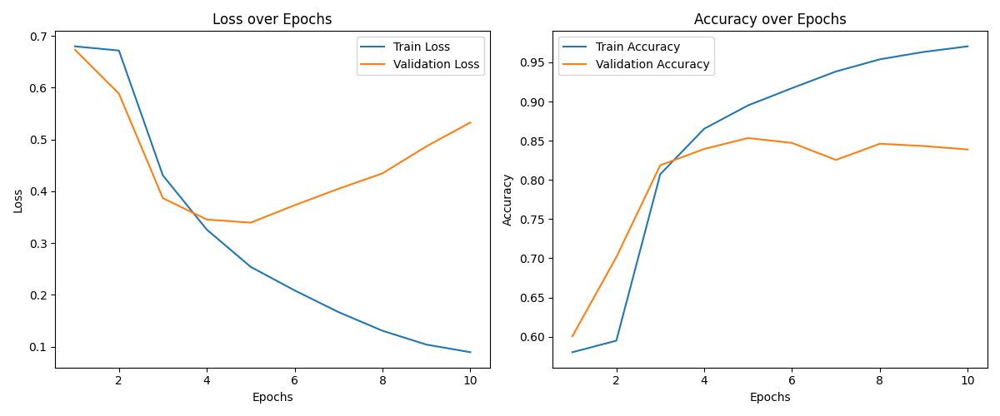

# HateSpeechLSTMClassifier

ヘイトスピーチ識別のためのLSTMベースのテキスト分類器です。
以下のブログ記事で、LSTMを使用してヘイトスピーチを識別する方法について詳しく説明しています。
[LSTMを用いた英語ヘイトスピーチ識別モデルの構築｜機械学習 – コバヤシ・ノート](https://kobayashinote.com/lstmspeechclassfier/)

## Environment
実行が確認できた環境は以下の通りです。
- OS: Windows 11
- Python: 3.12.12
- GPU: NVIDIA GeForce RTX 5070 Ti
- CUDA: 12.9

## Usage
### データセットのダウンロード
Kaggleで公開されている[Combined Hate Speech Dataset](https://www.kaggle.com/datasets/mahmoudabusaqer/combined-hate-speech-dataset) からデータセットをダウンロードしてください。
プログラムでは"data.csv"という名前でデータセットを配置することを想定しています。

### リポジトリのクローン
```bash
git clone https://github.com/kobayashiry0/HateSpeechLSTMClassifier
cd HateSpeechLSTMClassifier
``` 

### 必要なライブラリのインストール
Pythonパッケージ管理ツールとしてuvを使用します
```bash
uv sync
```

### 実行
```bash
uv run main.py
```